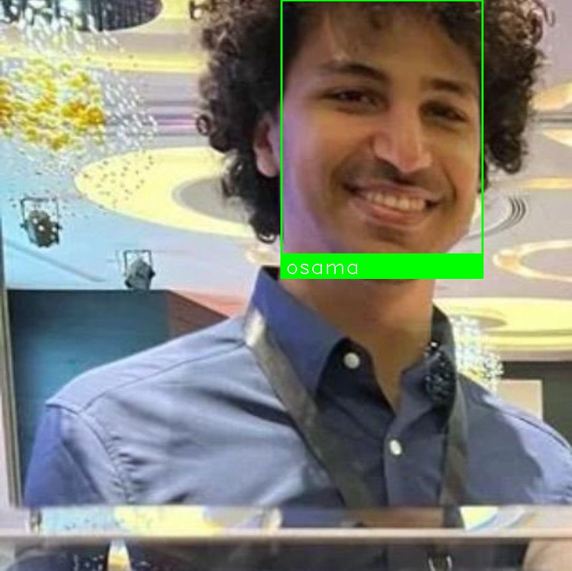

# Face Recognition System - Data Science CV Competition

A comprehensive face recognition system built for a Data Science Computer Vision competition. This project implements state-of-the-art face detection and recognition using deep learning models.

## 🎯 Project Overview

This face recognition system is designed to:
- Detect faces in images
- Recognize and identify known individuals
- Provide visual results with bounding boxes and name labels
- Handle multiple faces in a single image

The system was developed as part of a Data Science CV competition focused on face detection and recognition tasks.

## 🧠 Models and Techniques Used

### 1. **ArcFace (InsightFace)**
The primary model for face detection and feature extraction. ArcFace is a state-of-the-art deep learning model that:
- Extracts high-quality 512-dimensional face embeddings
- Provides robust face detection across varying conditions
- Uses additive angular margin loss for better face discrimination
- Supports both GPU (CUDA) and CPU execution

**Why ArcFace?** ArcFace achieves state-of-the-art performance on face recognition benchmarks and is particularly effective at distinguishing between similar faces.

### 2. **K-Nearest Neighbors (KNN) Classifier**
Used for face identification after feature extraction:
- **Algorithm**: K-Nearest Neighbors with k=1
- **Purpose**: Matches extracted face embeddings to known individuals
- **Advantage**: Works well with limited training data and is computationally efficient

### 3. **Data Augmentation**
To improve model robustness with limited training data:
- Adds random noise to face encodings
- Applies random scaling (0.9x to 1.1x)
- Adds random translations
- Normalizes augmented encodings to unit length
- Generates 25 augmented samples per original face encoding

### 4. **Image Preprocessing**
Optional preprocessing pipeline (available in code):
- Resizing to target dimensions (224x224)
- Color space conversion (BGR to RGB)
- Histogram equalization for contrast enhancement
- Pixel normalization to [0, 1] range

## 📊 Performance

The system achieves high accuracy on the training/validation split, with the exact accuracy depending on the dataset size and quality. The model is evaluated using:
- Train/test split (80/20)
- Accuracy score metric
- Cross-validation on multiple face images per person

## 🛠️ Installation

### Prerequisites
- Python 3.12.6 (or compatible version)
- pip package manager

### Dependencies
Install all required packages using the provided requirements file:

```bash
pip install -r requirements.txt
```

Or install packages individually:

```bash
pip install opencv-python-headless numpy face_recognition scikit-learn insightface
```

**Package breakdown:**
- `opencv-python-headless`: Image processing and visualization
- `numpy`: Numerical operations
- `face_recognition`: Face detection utilities
- `scikit-learn`: Machine learning algorithms (KNN)
- `insightface`: ArcFace model implementation

## 📁 Project Structure

```
Data-Science-Competition-CV/
├── main.py                      # Main face recognition script
├── requirements.txt             # Python package dependencies
├── dependencies.txt             # Alternative dependencies reference
├── recognition_results.json     # JSON file with recognition results
├── faces_data/                  # Training data directory
│   ├── person1/                 # Individual person's folder
│   │   ├── person1_img1.jpg
│   │   ├── person1_img2.jpg
│   │   └── ...
│   ├── person2/
│   │   └── ...
│   └── ...
├── test_images/                 # Images to recognize
│   ├── test1.jpg
│   ├── test2.jpg
│   └── ...
└── recognition_results/         # Output folder with annotated images
    ├── result_test1.jpg
    ├── result_test2.jpg
    └── ...
```

## 🚀 Usage

### 1. Prepare Training Data
Create a `faces_data` folder in the project directory with subfolders for each person:

```
faces_data/
├── john/
│   ├── john1.jpg
│   ├── john2.jpg
│   └── ...
├── jane/
│   ├── jane1.jpg
│   └── ...
└── ...
```

**Note:** Each person should have at least 2-3 face images for better recognition accuracy.

### 2. Add Test Images
Place images you want to recognize in the `test_images` folder:

```
test_images/
├── photo1.jpg
├── photo2.jpg
└── ...
```

### 3. Run the System
Execute the main script:

```bash
python main.py
```

The system will:
1. Load and process all training images from `faces_data`
2. Train the KNN classifier with face embeddings
3. Process all images in `test_images`
4. Detect and recognize faces
5. Save annotated results to `recognition_results`
6. Generate a JSON file with recognition results

## 📈 Results

The system successfully recognizes faces and generates annotated images with:
- Green bounding boxes around detected faces
- Name labels identifying each person
- High-quality visual output

### Sample Results

Below are examples of the face recognition system in action:

#### Example 1: Single Person Recognition

*Face successfully detected and recognized with bounding box and name label*

#### Example 2: Group Photo Recognition

*Multiple faces detected and recognized in a group setting*

#### Example 3: Different Lighting Conditions

*System robust to various lighting conditions*

#### Example 4: Real-world Scenario

*Recognition working on real-world casual photos*

### Recognition Statistics

The system processed **14 test images** with the following recognized individuals:
- tarshihi
- aws
- osama
- rihani
- shahwan
- murad
- bess
- kareem
- saif
- khaled
- tareq

All test images successfully detected and identified faces, demonstrating the robustness of the ArcFace + KNN approach.

## 🔑 Key Features

1. **Automatic Face Detection**: Detects faces automatically using ArcFace
2. **Multi-Face Support**: Can recognize multiple faces in a single image
3. **Data Augmentation**: Automatically augments limited training data
4. **GPU Acceleration**: Supports CUDA for faster processing
5. **Visual Output**: Generates annotated images with bounding boxes and labels
6. **JSON Export**: Saves recognition results in JSON format for further processing
7. **Robust Recognition**: Works across different lighting, angles, and conditions

## 🎓 Technical Highlights

- **State-of-the-art Face Recognition**: Uses ArcFace, one of the most accurate face recognition models
- **Efficient Training**: KNN classifier enables quick training even with limited data
- **Smart Augmentation**: Increases effective training data size without manual collection
- **Production-Ready**: Complete pipeline from detection to visualization
- **Flexible Architecture**: Easy to extend and customize for specific needs

## 📝 Algorithm Workflow

1. **Training Phase**:
   - Load face images from `faces_data` folder
   - Detect faces using ArcFace model
   - Extract 512-dimensional face embeddings
   - Apply data augmentation (if dataset is small)
   - Train KNN classifier on embeddings
   - Evaluate model accuracy on test split

2. **Recognition Phase**:
   - Load test images from `test_images` folder
   - Detect faces using ArcFace
   - Extract face embeddings
   - Predict identity using trained KNN classifier
   - Draw bounding boxes and labels
   - Save annotated results

## 🏆 Competition Context

This project was developed for a Data Science Computer Vision competition focused on face detection and recognition. The implementation demonstrates:
- Practical application of deep learning for computer vision
- Effective use of pre-trained models (transfer learning)
- Data augmentation techniques for limited datasets
- Complete ML pipeline from data to visualization

## 🔧 Customization Options

The system can be customized by modifying `main.py`:

- **KNN neighbors**: Change `n_neighbors` parameter for different recognition thresholds
- **Data augmentation**: Adjust `num_augmentations` parameter
- **Preprocessing**: Enable/disable histogram equalization
- **Image size**: Modify `target_size` parameter
- **Model backend**: Choose between CUDA and CPU execution

## 📄 Output Files

- **recognition_results/**: Folder containing annotated images
- **recognition_results.json**: JSON file mapping test images to recognized names

Example JSON output:
```json
{
    "test_photo1.jpg": "john",
    "test_photo2.jpg": "jane",
    "group_photo.jpg": "john"
}
```

## 🤝 Contributing

This project was created for a DS competition. Feel free to fork and adapt for your own face recognition needs!

## 📜 License

This project is open source and available for educational and research purposes.

## 🙏 Acknowledgments

- **InsightFace**: For the excellent ArcFace implementation
- **scikit-learn**: For machine learning utilities
- **OpenCV**: For image processing capabilities
- Data Science CV Competition organizers

---

**Author**: Created for Data Science CV Competition  
**Focus**: Face Detection and Recognition  
**Models**: ArcFace (InsightFace) + K-Nearest Neighbors
